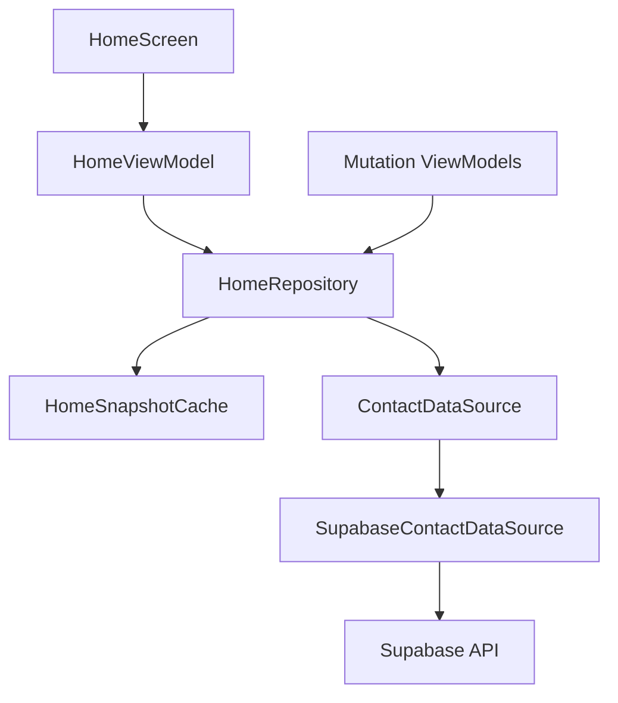

# Requirements

### Overview & Goals
- Make Home render the most recent available data immediately when the user returns from another screen.
- Refresh Supabase data in the background using a stale-while-revalidate policy.
- Reduce repeated Home requests caused by ViewModel/composition recreation without changing the existing Home UX or Supabase schema.

### Current Findings
- `HomeViewModel.loadContacts()` currently performs four sequential reads through `ContactDataSource`: contacts, groups, recent check-ins, and full check-in history.
- `HomeScreen` only explicitly reloads after saving a new contact; returning to Home otherwise depends on a newly created ViewModel fetching from the network.
- The project has local persistence for onboarding drafts (`DataStoreOnboardingDraftDataSource` on Android and `NSUserDefaultsOnboardingDraftDataSource` on iOS), but no local Home data cache.
- Supabase auth/session persistence is separate from application data caching.

### Scope
#### In scope
- Cache the Home snapshot in memory for the current app process.
- Show cached contacts, groups, memberships, and check-in data immediately when available.
- Refresh cached data on Home entry and foreground when the snapshot is stale.
- Keep the first launch/cache-miss behavior network-backed.
- Invalidate or force-refresh the snapshot after contact, group, membership, and check-in mutations.
- Prevent cache reuse across different authenticated users.

#### Out of scope
- A persistent disk database or serialized Home snapshot surviving process termination.
- Offline mutation queues, conflict resolution, or a general application-wide caching framework.
- Caching contact profile notes/reminders or unrelated Home sub-features.
- Supabase schema or RLS changes.

### Acceptance Criteria
- Returning to Home with a warm cache renders the previous Home content without waiting for Supabase.
- A background refresh replaces the snapshot when successful and updates counts/check-in state.
- A failed refresh does not erase usable cached content; the UI can retain the last-known data and expose the existing error state appropriately.
- A Home cache miss still shows the current loading behavior until the first successful load.
- Creating/moving/deleting contacts or groups and logging a check-in cannot leave Home showing stale cached data after the next refresh.
- Logging out or switching accounts cannot expose the previous account’s cached contacts or groups.

# Technical Design

### Key Decisions
- **Repository cache:** Add a Home-specific repository/snapshot cache above the existing `ContactDataSource`, rather than introducing a database or changing Supabase queries. This matches the current CompositionLocal dependency-injection pattern and keeps the first slice small.
- **Stale-while-revalidate:** Return the in-memory snapshot immediately, then refresh Supabase in the background on Home entry/foreground when the freshness window has elapsed. A cache miss performs the existing blocking load.
- **Shared process scope:** Create the repository once in `OnboardingDraftStoreProvider` alongside `SupabaseContactDataSource`, so it survives Home ViewModel recreation while the app composition remains alive.
- **Mutation invalidation:** Mutating ViewModels use the shared invalidation mechanism, and Home’s explicit post-save reload bypasses the cache, ensuring the next snapshot reflects successful writes.
- **Account isolation:** Associate cached data with the authenticated Supabase user/session identity and clear or replace it when the identity changes; never use one account’s snapshot for another account.

### Proposed Components
- `HomeSnapshot` — immutable aggregate containing the four datasets currently assembled by `HomeViewModel`: contacts, groups, group memberships, recent check-ins, and check-in history/count inputs, plus a timestamp and account key.
- `HomeRepository` (new Home data/domain boundary) — owns the snapshot, freshness check, refresh de-duplication, and cache invalidation; delegates all server reads to `ContactDataSource` and returns typed `Result` values.
- `HomeViewModel` — consume the repository instead of issuing four direct reads; apply a cached snapshot with `isLoading = false`, then apply the refreshed snapshot and recompute group counts/reminders. Add a stale-aware refresh entry point for lifecycle events and retain a force-refresh path after mutations.
- DI provider — instantiate and remember one `HomeRepository` per Supabase client in `LocalOnboardingDraftStoreProvider.kt`; update `rememberHomeViewModel()` and relevant mutation ViewModel factories to share it.
- Lifecycle integration — reuse the existing `LifecycleEventObserver` in `HomeScreen.kt` to request a stale refresh on `ON_START`, while the repository prevents duplicate concurrent refreshes.
- Mutation invalidation — wire successful operations in `AddContactViewModel.kt`, `GroupSettingsViewModel.kt`, `GroupDetailViewModel.kt`, and `HomeViewModel.checkIn()` to invalidate or force-refresh affected Home data.

### Data Flow

### Refresh Semantics
- On repository initialization/Home entry, read a valid current-user snapshot synchronously from memory and publish it immediately.
- If the snapshot is missing or stale, start one refresh job; concurrent callers share/skip that refresh rather than issuing duplicate four-query batches.
- On successful refresh, atomically replace the complete snapshot so contacts, groups, memberships, and check-in data represent one refresh cycle.
- On refresh failure with an existing snapshot, retain the snapshot, stop the refreshing state, and preserve the error for the existing error presentation; on cache miss, preserve the current empty/loading failure behavior.
- Use the existing date-window helpers in `HomeViewModel` for recent/history check-ins, and force a new windowed snapshot when the local day changes.

### File Structure
- Add a Home repository/cache and snapshot model under `home/src/commonMain/kotlin/app/usenekko/home/data/` or the existing Home domain/data boundary.
- Modify `home/src/commonMain/kotlin/app/usenekko/home/presentation/HomeViewModel.kt` and `HomeState.kt` for cached-first and refresh states.
- Modify `home/src/commonMain/kotlin/app/usenekko/home/HomeScreen.kt` for stale foreground refresh.
- Modify `onboarding/src/commonMain/kotlin/app/usenekko/onboarding/presentation/LocalOnboardingDraftStore.kt` and `home/src/commonMain/kotlin/app/usenekko/home/di/LocalContactDataSource.kt` for shared construction/injection.
- Update the successful mutation paths in `home/src/commonMain/kotlin/app/usenekko/home/addcontact/AddContactViewModel.kt`, `home/src/commonMain/kotlin/app/usenekko/home/presentation/settings/GroupSettingsViewModel.kt`, `GroupDetailViewModel.kt`, and Home check-in handling.

### Risks & Mitigations
- **Stale data after mutations:** centralize invalidation and keep force-refresh after successful writes.
- **Duplicate refreshes:** guard refreshes with a shared in-flight job/mutex in the repository.
- **Account leakage:** key snapshots by current user and clear on session identity changes.
- **Date rollover:** mark snapshots stale when the local date changes so check-in status and timeline windows are rebuilt.

# Testing

### Validation Approach
- Add unit coverage in the existing Android Home test area, using `FakeContactDataSource` call counters and controllable results.
- Verify repository behavior independently, then verify `HomeViewModel` applies cached and refreshed snapshots correctly.

### Key Scenarios
- First Home load with no cache performs the expected server reads and publishes populated state.
- Second Home ViewModel using the same repository renders cached data immediately and does not block on the first network response.
- A stale cache renders first, then a successful refresh replaces contacts/groups/check-ins and recomputes outstanding/up-to-date counts.
- Multiple refresh triggers while one refresh is running result in one server batch, not duplicate requests.
- Successful contact/group/membership/check-in mutations invalidate the relevant snapshot, and the following Home refresh reads current data.

### Edge Cases
- Network failure with cached data retains the last-known Home content and reports refresh failure without reverting to the empty state.
- Network failure with no cache preserves the existing initial-load error behavior.
- Switching authenticated user identities never renders the previous user’s snapshot.
- Crossing a local calendar day forces fresh check-in windows and removes stale pulse/check-in status.
- Home lifecycle `ON_START` refreshes only when stale and does not cause a request on every recomposition.

### Regression Checks
- Run Home-focused unit tests, `:home:allTests` or the project’s configured Home test task, Android compilation, and `git diff --check`.
- Confirm existing check-in, group filtering, contact creation, and timeline tests remain green.

# Delivery Steps

### ✓ Step 1: Create shared Home snapshot repository
A shared `HomeRepository` serves a current-user Home snapshot from memory and coordinates stale refreshes.

- Add the immutable snapshot model for contacts, groups, memberships, and both check-in query results.
- Implement cache timestamps, current-user scoping, date rollover detection, refresh de-duplication, and invalidation.
- Delegate cache misses/refreshes to the existing `ContactDataSource` without changing the Supabase schema or API contracts.

### ✓ Step 2: Wire cached-first Home loading
`HomeViewModel` renders cached Home data immediately and refreshes stale data without replacing usable content with a loading screen.

- Replace the four direct reads in `HomeViewModel.loadContacts()` with repository snapshot loading.
- Preserve existing count computation, timeline inputs, reminder reconciliation, error behavior, and force-refresh after contact creation/check-in.
- Add lifecycle-driven stale refresh from the existing `HomeScreen` foreground observer.

### ✓ Step 3: Share invalidation across Home mutations
Successful contact and group mutations invalidate the shared Home snapshot so returning to Home cannot display known-stale data.

- Construct one repository per Supabase client in `LocalOnboardingDraftStoreProvider` and inject it through the existing Home DI factories.
- Update `AddContactViewModel`, `GroupSettingsViewModel`, and `GroupDetailViewModel` mutation paths to invalidate affected Home data.
- Ensure cache identity changes clear prior-account data and preserve the existing direct behavior of profile notes/reminders.

### ✓ Step 4: Add cache regression coverage
Home cache behavior is covered by deterministic tests and existing Home behavior remains validated.

- Extend the fake data source with request counters and controllable refresh results.
- Test cold load, warm cached load, stale-while-revalidate, refresh de-duplication, mutation invalidation, refresh failure retention, account isolation, and date rollover.
- Run focused Home tests, configured module tests, Android compilation, and whitespace validation.

### ✓ Step 5: Cache the Add Contact group picker
The Add Contact group picker reads groups from the shared `HomeRepository` and handles both warm and cold cache entry paths.

- Expose a narrow derived groups flow from the repository rather than issuing a separate group query.
- Show a loading state when Add Contact is opened before the repository has a snapshot.
- Ensure successful contact creation invalidates the shared snapshot for both Add Contact and Home.
- Add focused tests
- for warm data, cold loading, refresh updates, and mutation invalidation.

### ✓ Step 6: Cache the Account screen
The Account screen renders cached profile, badge, contact-count, and check-in-count data immediately, then refreshes stale sources in the background.

- Add a process-scoped Account repository for profile and badge data with the same 30-second TTL, deduplication, invalidation, and account isolation as Home.
- Derive Account contact and check-in totals from the shared Home snapshot instead of issuing duplicate reads.
- Refresh stale Account data on foreground entry and invalidate badge/profile data after relevant mutations.
- Add focused tests for warm loading, stale-while-revalidate, refresh deduplication, failure retention, account isolation, and check-in invalidation.

### ✓ Step 7: Cache Brainstorm history
Brainstorm history renders the latest available entries immediately and refreshes stale history without changing generation behavior.

- Add a process-scoped `BrainstormRepository` with a 30-second stale-while-revalidate policy, refresh deduplication, invalidation, and authenticated-account isolation.
- Keep `generate()` network-backed and preserve the existing daily cooldown and error behavior.
- Update `BrainstormViewModel` and `BrainstormScreen` to consume cached history and refresh on foreground entry with a subtle refresh state.
- Add focused tests for cold loading, warm cached history, stale refresh, refresh deduplication, failure retention, account isolation, and generation invalidation.

### ✓ Step 8: Add Home initial loading shimmer
Home shows a Facebook-style shimmer skeleton only while the initial Home snapshot is unavailable.

- Add skeleton placeholders for the status summary, timeline, and contact rows using the existing Home layout proportions.
- Keep the existing empty state for a successfully loaded account with no contacts.
- Keep warm cached content visible during stale-while-revalidate refreshes and validate the Home module build.

### ✓ Step 9: Add Brainstorm history loading shimmer
Brainstorm history shows a Facebook-style shimmer skeleton only while the initial history cache is unavailable.

- Replace the initial centered spinner with date-heading and topic-card placeholders matching the history layout.
- Keep warm history visible during stale-while-revalidate refreshes and preserve the existing empty and error states.
- Add focused coverage for the initial loading presentation and validate the Brainstorm module build.

### ✓ Step 10: Add Groups bottom-sheet loading shimmer
The Groups bottom sheet shows Facebook-style group-card placeholders while its initial group data is unavailable.

- Replace the initial centered spinner with a small grid of group-card skeletons matching the existing sheet layout.
- Keep warm group content visible during background refreshes and preserve the existing empty and error states.
- Add focused coverage for the initial loading presentation and validate the Home module build.

### ✓ Step 11: Add Group Detail loading shimmer
Group Detail shows Facebook-style member-row placeholders only while its initial member data is unavailable.

- Replace the initial centered loader with member-row skeletons matching the existing Group Detail layout.
- Keep warm member content visible during background refreshes and preserve the existing empty and error states.
- Add focused coverage for the initial loading presentation and validate the Home module build.

### ✓ Step 12: Add Group Settings loading shimmer
Group Settings shows Facebook-style group-row placeholders only while its initial group data is unavailable.

- Replace the initial centered loading label with skeleton rows matching the existing group settings layout.
- Keep warm group content visible during background refreshes and preserve the existing empty and error states.
- Add focused coverage for the initial loading presentation and validate the Home module build.