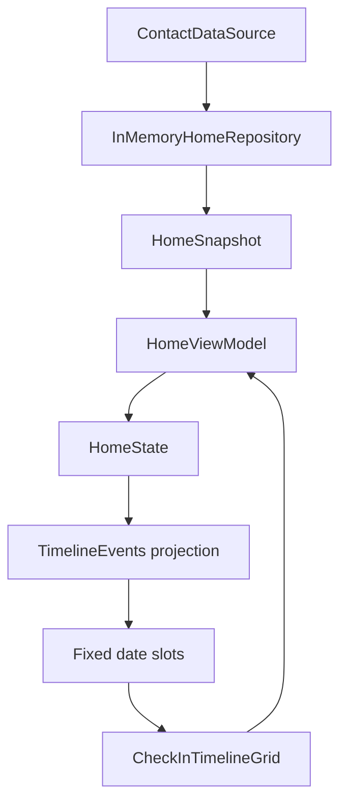

# Requirements

### Overview & Goals
Fix the Home check-in/relationship tracker grid so each cell represents a stable calendar date, recurring contacts appear only on the date they are due, and completed check-ins remain visible in their original date cells as the current day advances.

### Scope
#### In scope
- Keep the existing 26-cell chronological grid as consecutive calendar dates, anchored to a rolling date range around today (`today - 12 days` through `today + 13 days`). The window advances only when the calendar date changes, never when occurrences are completed.
- For each visible date, show the contacts scheduled for that exact date and resolve each occurrence independently as completed, missed, pending, or future according to its date and matching check-in history.
- Show a newly added contact in today’s cell only when its first check-in is actually scheduled for today. Preserve an explicit future first scheduled date as a future occurrence, but keep that future cell visually neutral without an avatar until the date becomes current; use the current-day fallback only when no first scheduled date exists.
- When the user has just started and a first check-in is due today, begin the countdown window with today in the first cell; established timelines retain the rolling window around today.
- Show daily, weekly, biweekly, and monthly contacts only on their scheduled occurrence dates; do not fill intervening or premature future cells with avatars.
- Keep a missed occurrence in its original historical date cell and never carry it into today or later cells. A contact appears again only when its recurrence schedule produces another due date.
- After a successful check-in, mark that contact’s occurrence complete on its exact date and advance the contact’s next due date without moving or removing the completed history.
- Keep multiple contacts scheduled for the same date in one cell, while displaying each contact’s own status and avatar/count independently.

#### Out of scope
- Adding interactive date navigation or changing the existing contact-row check-in action.
- Changing recurrence intervals, streak calculations, reminder scheduling, or Supabase schema.
- Changing the separate contacts/groups navigation screen.

### Acceptance Criteria
- A daily contact checked in today remains visible as completed in today’s cell after the timeline advances to tomorrow, while the next daily occurrence appears only in tomorrow’s cell; the date positions remain unchanged.
- A weekly contact is absent from the cells between scheduled dates and does not appear in the next-week cell before that date becomes current.
- A contact due on a past date without a matching check-in remains in that original cell as missed/incomplete and is not rendered in today’s cell.
- The grid’s date-to-cell positions do not change when occurrences are added, completed, refreshed, or removed; only the date advancing moves the rolling window.
- Full check-in history within the visible window is rendered from the actual check-in dates, even after a contact’s `nextCheckInDate` advances.
- A newly added contact whose first check-in is due today appears in today’s cell; one whose first check-in is scheduled later does not appear in today’s cell or as an avatar in a future cell before that scheduled date becomes current.
- A newly started timeline with a first check-in due today places that occurrence in slot zero, with later cells acting as the countdown sequence rather than placing today in the middle.
- Future cells retain their neutral future indicator and do not display contact avatars before their scheduled dates become current.
- A date containing several contacts shows each scheduled occurrence and its own completed, missed, or pending state; the date does not become a single all-contacts completion state.

# Technical Design

### Current Implementation
- `home/src/commonMain/kotlin/app/usenekko/home/HomeScreen.kt` owns the local current date, passes `HomeState.checkIns` and filtered contacts into `buildCheckInTimelineEvents`, and renders the result through `rememberTimelineSlots` and `CheckInTimelineGrid`.
- `home/src/commonMain/kotlin/app/usenekko/home/presentation/components/TimelineEvents.kt` combines `CheckIn` rows with contact scheduling fields. The current working-tree version correctly separates actual history from due contacts, but still feeds an event-anchored start into the grid.
- `home/src/commonMain/kotlin/app/usenekko/home/presentation/components/CheckinGrid.kt` has a fixed `TIMELINE_SLOT_COUNT` of 26 and chronological slot construction, but `rememberTimelineSlots` currently uses `timelineStartForEvents`, allowing the visible range to shift when the event set changes.
- `home/src/commonMain/kotlin/app/usenekko/home/data/HomeRepository.kt` already fetches both a recent range and an all-time `checkInHistory` range in `HomeSnapshot`.
- `home/src/commonMain/kotlin/app/usenekko/home/presentation/HomeViewModel.kt` owns check-in mutations and invalidates/reloads the repository after success; the timeline must use the all-time history field rather than only the recent-range field.
- Tests are Android local JUnit tests in `androidApp/src/test/kotlin/app/usenekko/home`, with existing focused coverage in `TimelineEventsTest.kt` and `HomeViewModelCheckInTest.kt`.

### Key Decisions
- **Pure timeline projection:** Keep date-to-event computation in `TimelineEvents.kt` and slot rendering in `CheckinGrid.kt`; `HomeViewModel` continues to expose repository-backed state. This preserves the existing Kotlin Multiplatform separation and makes cadence/date rules directly unit-testable.
- **Stable rolling anchor:** Build slots from `timelineStartForToday(today)` rather than the earliest event. A date’s logical index remains stable when an occurrence changes status or a refresh changes the event list; the window shifts only at the local calendar date boundary.
- **Occurrence-date rendering:** Project the schedule onto each visible calendar date, then match each contact/date occurrence against `CheckIn.localDate()`. Assign status per occurrence (`completed`, `missed`, `pending`, or `future`), retain missed occurrences on their scheduled past dates, and never carry them forward. Do not project avatars into future dates or into intervening weekly/biweekly dates.
- **First-occurrence handling:** Respect an explicit first scheduled date for a newly added contact. Render it as an actionable occurrence only when that date is today or historical; keep future first occurrences logically date-bound but visually neutral until their date becomes current. Apply the current-day fallback only when the contact has no first scheduled date.
- **Initial countdown anchor:** When there is no completed check-in history and a contact is due for the first time today, pass an explicit `today` start date to the grid so the first occurrence is in slot zero; use the normal rolling anchor once history exists.
- **Per-occurrence aggregation:** A cell is a date container, not a completion unit. When several contacts are scheduled on one date, render their statuses independently rather than marking the cell complete only after all contacts finish.
- **Full-history source:** Keep `recentCheckIns` for short-range repository concerns, but expose/use `HomeSnapshot.checkInHistory` for calendar history so a completed date is not lost when the current contact fields advance.

### Proposed Changes
- Update `TimelineEvents.kt` to build date-keyed scheduled occurrences, merge them with exact-date completed check-in IDs, and retain date-keyed missed occurrences without copying them into later dates.
- Deduplicate contacts within a date and preserve the correct mixed completed/missed/pending state when several contacts share a date; do not collapse the cell into one all-complete flag.
- Keep the current-day fallback only for a newly created contact with no first scheduled date; never replace an explicit future first date with today, and ensure malformed dates/frequencies do not create phantom future occurrences.
- Update `CheckinGrid.kt` so `rememberTimelineSlots` always starts at `timelineStartForToday(today)`. Remove or stop using event-anchored start calculation and keep future-dot, avatar, badge, and cell-size behavior unchanged.
- Allow `rememberTimelineSlots` to accept the explicit initial-countdown start without changing the default rolling anchor or future-cell rendering.
- Ensure `HomeViewModel.applySnapshot` supplies `snapshot.checkInHistory` to `HomeState.checkIns`; retain the existing post-success invalidate/force-refresh flow so the new `CheckIn` row and updated contact dates arrive together.
- Keep `HomeScreen.kt` date recomputation tied to the local timezone so the fixed window and due-date projection recalculate at the local day boundary.
- Reconcile the existing uncommitted timeline/state edits in these files instead of replacing unrelated work.

### Architecture Diagram


### Risks
- `CheckIn.localDate()` must continue using the device’s local timezone consistently with `HomeViewModel.today()`; otherwise a backend timestamp near midnight can land in the wrong cell.
- A contact’s overdue status is still used by the existing today contact list and check-in mutation flow; this change only makes timeline occurrence placement date-specific and does not add historical-date check-in actions.
- The all-time history query is already part of `HomeRepository`; the projection must still limit rendered output to the 26 visible dates to avoid unnecessary UI work.

# Testing

### Validation Approach
Use the existing Android local JUnit setup and pure timeline helpers; no new testing framework is required. Run the focused regression suites with:

```text
./gradlew :androidApp:testDebugUnitTest --tests app.usenekko.home.TimelineEventsTest --tests app.usenekko.home.HomeViewModelCheckInTest
```

### Key Scenarios
- Verify the fixed 26-slot window keeps the same date positions when an occurrence changes from pending to completed and when today advances by one day; completion never advances the window.
- Verify a newly added contact due today appears in today’s cell, completes there, and produces only the next scheduled occurrence on its recurrence date.
- Verify a first-time due-today contact is rendered in slot zero as a countdown start, while an established timeline still keeps today at its rolling position.
- Verify a newly added contact with a future first scheduled date is absent from today’s cell and future cells remain neutral until that date becomes current, when the occurrence appears in its scheduled cell.
- Verify weekly, biweekly, and monthly contacts appear on their scheduled dates only, with no avatars on intervening or premature future dates.
- Verify a missed occurrence remains in its original past-date cell, is not carried into today, and reappears only at the next recurrence date.
- Verify a completed check-in from the previous day remains visible after a later-day check-in and repository refresh.
- Verify multiple contacts sharing a date render independent statuses, including mixed completed, missed, and pending occurrences, without requiring all contacts to complete before the date is historical.

### Edge Cases
- Missed scheduled dates remain represented on their original timeline dates without creating repeated daily/weekly phantom events.
- Duplicate backend check-in rows for one contact/date do not inflate the visible avatar stack.
- A contact with no first scheduled date gets only the intended current-day fallback, while an explicit future first date is preserved and malformed date/frequency data does not create phantom occurrences.
- Check-ins near a local midnight are grouped by the same local date used by the UI.

### Test Changes
- Extend `androidApp/src/test/kotlin/app/usenekko/home/TimelineEventsTest.kt` for date-only window advancement, exact occurrence dates, independent completed/missed/pending statuses, future-dot behavior, missed-occurrence non-carry-forward, and next-day history retention; replace expectations that require event-anchored starts.
- Extend `androidApp/src/test/kotlin/app/usenekko/home/TimelineEventsTest.kt` to assert the initial countdown start date and slot-zero placement.
- Extend `androidApp/src/test/kotlin/app/usenekko/home/HomeViewModelCheckInTest.kt` to assert that a successful check-in followed by reload retains the prior check-in row and updated next due date.
- Keep `FakeContactDataSource.kt` able to distinguish full-history and recent-range responses so the regression proves the grid is not accidentally fed only the recent snapshot.

# Delivery Steps

### ✓ Step 1: Stabilize fixed-date timeline projection
The check-in grid renders a stable 26-date window with occurrences attached to their exact scheduled or completed dates.

- Update `home/src/commonMain/kotlin/app/usenekko/home/presentation/components/TimelineEvents.kt` to project scheduled contacts onto exact dates, merge immutable check-in history, and assign status independently per contact/date occurrence.
- Preserve daily, weekly, biweekly, and monthly cadence rules without filling intervening dates, carrying missed occurrences forward, or revealing future avatars early.
- Respect a newly added contact’s explicit first scheduled date; only contacts first due today use the current-day initial fallback, while future first occurrences remain visually hidden until their date is current.
- Update `home/src/commonMain/kotlin/app/usenekko/home/presentation/components/CheckinGrid.kt` so slot construction always uses `timelineStartForToday(today)`; only date advancement changes the rolling position.
- Extend `androidApp/src/test/kotlin/app/usenekko/home/TimelineEventsTest.kt` for fixed anchoring, exact due dates, date-locked missed occurrences, mixed same-day statuses, and future cells.

### ✓ Step 2: Preserve history through check-in and day changes
A completed check-in remains visible on its original date after refreshes and after the local calendar advances.

- Ensure `home/src/commonMain/kotlin/app/usenekko/home/presentation/HomeViewModel.kt` exposes `HomeSnapshot.checkInHistory` for the timeline while retaining the existing invalidate and force-refresh flow.
- Keep `home/src/commonMain/kotlin/app/usenekko/home/data/HomeRepository.kt` full-history loading contract aligned with the calendar’s visible-window projection.
- Keep `home/src/commonMain/kotlin/app/usenekko/home/HomeScreen.kt` recomputing the pure projection when the local date changes, without introducing date navigation or changing contact-row actions.
- Update `androidApp/src/test/kotlin/app/usenekko/home/FakeContactDataSource.kt` and `HomeViewModelCheckInTest.kt` to cover successful completion, reload, next-day rendering, date-locked missed occurrences, and separation of recent versus full history.
- Run the focused `:androidApp:testDebugUnitTest` timeline and ViewModel suites to validate the integrated behavior.

### ✓ Step 3: Start the first-use countdown at slot zero
The first check-in for a newly started user is shown in the first calendar cell instead of the centered current-day position, while established history keeps the rolling window.

- Add an explicit initial-countdown start-date option to the timeline slot construction.
- Enable that option from `HomeScreen.kt` only when the timeline has no completed history and a contact’s first occurrence is due today.
- Update `TimelineEventsTest.kt` for exact slot-zero placement and keep the existing centered-window coverage for established history.

### ✓ Step 4: Preserve the initial countdown anchor after completion
The first-use countdown remains anchored at its original first-check-in date after the first successful check-in and the resulting state refresh.

- Keep the initial countdown anchor associated with the active first-use timeline rather than deriving its lifetime from the current check-in history.
- Ensure the completed first occurrence and the next scheduled occurrence remain in consecutive cells after check-in.
- Extend regression coverage for the post-check-in refresh state so the first cell does not recenter.

### ✓ Step 5: Keep the countdown anchor in durable Home state
The first-use anchor must survive the refresh/recomposition boundary that currently returns the completed occurrence to the centered rolling window.

- Move ownership of the active initial countdown start date from `HomeScreen` local state into `HomeViewModel`/`HomeState` while keeping date projection pure.
- Preserve the anchor when the repository publishes the updated contact and full check-in history after a successful check-in.
- Add a regression that recreates the screen state from the refreshed snapshot and still places the completed first occurrence in slot zero.

### ✓ Step 6: Preserve distinct historical avatars after later-day check-ins
Historical occurrences must keep their own date and avatar after one or more contacts complete a later day’s check-ins and the Home state refreshes.

- Reproduce the multi-day, multi-contact sequence through the timeline projection and rendered slot models.
- Ensure completed history rows remain grouped by their exact local check-in date and contact, without collapsing into the latest date or becoming an empty cell.
- Add focused regression coverage for the earlier single-contact cell and the later mixed-contact cell, then validate the integrated Home tests.

### ✓ Step 7: Render missed dates without historical avatars
When a scheduled date passes without a check-in, its occurrence remains date-locked and automatically changes to a missed state without waiting for a later check-in; the missed cell uses the `ic_sprout` indicator instead of an avatar or an oversized empty avatar cell.

- Derive missed status from the visible date and local `today` during timeline projection so advancing the device date is sufficient to update the cell.
- Keep completed occurrences and their avatars unchanged, while hiding avatars for missed occurrences and preserving the occurrence’s exact historical date.
- Render the sprout indicator for missed date cells using the existing timeline icon conventions without carrying the missed contact into today or later dates.
- Add focused timeline/slot regression coverage for date advancement, missed-cell avatar suppression, and sprout rendering, then run the relevant Home tests.