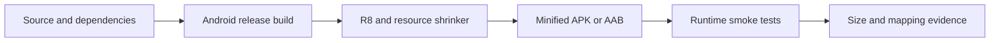

# Requirements

### Overview & Goals
Create a dedicated `feature/r8-optimization` branch from the current `main` baseline and make the Android release artifact use R8 shrinking and resource shrinking safely. The result must reduce unused code/resources without changing authentication, onboarding, Home, deep-link, or reminder behavior.

### Current Findings
- `androidApp/build.gradle.kts` uses the optimized default configuration file but sets `release.isMinifyEnabled = false`, so R8 and resource shrinking are currently inactive.
- `androidApp/proguard-rules.pro` contains only the generated template comments; there are no project-specific keep rules, global disable rules, or broad package-wide rules to remove.
- `gradle/libs.versions.toml` pins AGP `9.0.1`; `gradle.properties` does not contain `android.enableR8.fullMode=false`, so no full-mode opt-out needs removal.
- `AndroidManifest.xml` declares `.MainActivity` and `CheckInReminderReceiver`; these manifest entry points must be exercised in a minified build, especially the receiver used after the app process is killed.
- Kotlin serialization DTOs in `onboarding/.../dto/OnboardingDtos.kt`, Supabase clients/data sources, and RevenueCat initialization are the main areas where release-only reflection or generated-code issues would be visible if a dependency requires a narrowly scoped rule.

### Scope

#### In scope
- Establish the requested `feature/r8-optimization` branch and keep the work isolated from `main`.
- Enable R8 code shrinking, obfuscation, and optimized resource shrinking for the Android `release` build.
- Audit release-build warnings and generated R8 configuration before adding any custom rule.
- Add only evidence-based, narrowly scoped rules for application or dependency entry points that fail under minification.
- Validate release size, mapping output, startup, auth deep links, onboarding/Home flows, and scheduled reminder delivery.

#### Out of scope
- Changing AGP/Kotlin/Compose/Supabase versions as part of this optimization.
- Adding package-wide `-keep` rules to silence warnings without proving runtime reachability.
- Changing Kotlin Multiplatform source behavior or adding R8 rules to iOS targets.
- Removing UI features, notification behavior, or history/data logic to improve size.

### Acceptance Criteria
- The release build completes with `isMinifyEnabled = true` and `isShrinkResources = true` using `proguard-android-optimize.txt`.
- No global R8 disable flags or speculative broad keep rules are introduced.
- Release smoke tests cover `MainActivity`, auth callback handling, onboarding serialization, Home navigation, and `CheckInReminderReceiver`.
- The final APK/AAB, mapping, and shrinker outputs are generated and compared with the non-minified baseline.
- Any custom keep rule is tied to a documented warning or reproducible release-only failure and is as narrow as the affected API permits.

# Technical Design

### Current Implementation
- `androidApp/build.gradle.kts` is the only Android application build configuration and owns the `release` build type, default optimized ProGuard file, and `androidApp/proguard-rules.pro`.
- `build.gradle.kts` applies the Android application plugin through the version catalog; `gradle/libs.versions.toml` supplies AGP `9.0.1`.
- `MainActivity` initializes Supabase deep-link handling, `ReminderScheduler`, RevenueCat, and Compose navigation.
- `AndroidManifest.xml` registers `MainActivity` as the launcher/deep-link activity and `CheckInReminderReceiver` as a non-exported alarm receiver.
- Serialization and network models are implemented in the onboarding and home Supabase data sources with `@Serializable` DTOs and generated serializers, not manual reflection in application code.

### Key Decisions
- **Enable standard optimized shrinking first:** set release minification and resource shrinking in `androidApp/build.gradle.kts` while retaining `proguard-android-optimize.txt`; this uses the platform’s baseline consumer rules before custom configuration.
- **Prefer no custom rules:** keep the project rules file empty or limited to comments unless the release build exposes a concrete missing class, stripped entry point, or runtime failure.
- **Use surgical fallbacks:** if serialization, Supabase/auth, RevenueCat, or notification behavior fails, keep only the exact class members/classes required by the failing path and document why the dependency’s consumer rules are insufficient.
- **Validate behavior before size claims:** compare release artifact size and R8 outputs only after functional smoke tests pass, since an aggressively small artifact that breaks callbacks or alarms is not an acceptable optimization.
- **Keep branch isolation explicit:** all implementation and validation changes belong on `feature/r8-optimization`; no source changes are made on `main`.

### Proposed Changes
1. On `feature/r8-optimization`, update `androidApp/build.gradle.kts` so the `release` build enables `isMinifyEnabled` and `isShrinkResources` and continues using the optimized default configuration plus `proguard-rules.pro`.
2. Inspect the release shrinker output and dependency consumer rules; classify warnings as missing optional classes, genuine reflective entry points, or safe-to-ignore diagnostics rather than suppressing them wholesale.
3. Add a minimal rule to `androidApp/proguard-rules.pro` only when a reproducible release failure requires it. Prioritize manifest components and generated serialization classes only if their runtime tests demonstrate stripping; do not keep entire `app.usenekko` or dependency packages.
4. Build and install the minified release, exercise the critical flows, and compare APK/AAB size, mapping, shrinker usage/configuration outputs, resource usage, and startup against the current non-minified release.
5. Record the final rules and any accepted warnings in the plan or a focused build note so future changes can distinguish required contracts from obsolete workarounds.

### R8 Configuration Contract

```kotlin
buildTypes {
    release {
        isMinifyEnabled = true
        isShrinkResources = true
        proguardFiles(
            getDefaultProguardFile("proguard-android-optimize.txt"),
            "proguard-rules.pro",
        )
    }
}
```

`gradle.properties` must continue to omit `android.enableR8.fullMode=false`. No `android.r8.optimizedResourceShrinking` flag is needed for this AGP `9.0.1` baseline.

### Architecture Flow


### File Structure
- Modify `androidApp/build.gradle.kts` for release minification and resource shrinking.
- Audit `androidApp/proguard-rules.pro`; modify it only for a proven, narrowly scoped keep rule.
- Inspect `androidApp/src/main/AndroidManifest.xml`, `androidApp/src/main/kotlin/app/usenekko/MainActivity.kt`, and `shared/src/androidMain/kotlin/app/usenekko/shared/notifications/CheckInReminderReceiver.kt` as release entry-point contracts.
- Inspect `onboarding/src/commonMain/kotlin/app/usenekko/onboarding/data/supabase/dto/OnboardingDtos.kt` and the Supabase data-source implementations when class-retention diagnostics implicate serialization or auth.
- Update/add Android release validation coverage beside `androidApp/src/test` only where deterministic behavior can be checked without replacing real-device smoke validation.

### Risks
- A minified build can remove or rename code used indirectly by a dependency; mitigate with release-only functional checks and targeted rules, not a package-wide keep.
- Alarm delivery happens after process death; test `CheckInReminderReceiver` from a scheduled alarm, not only while the app is open.
- Resource shrinking can remove assets referenced indirectly by Compose/resources or manifest configuration; verify onboarding, Home, icons, and notification rendering.
- R8 warnings from optional library integrations may be non-fatal; classify them before adding rules or suppressions.

# Testing

### Validation Approach
- Build the current non-minified release as the baseline, then build the minified/resource-shrunk release from the feature branch.
- Compare APK/AAB size, `mapping.txt`, R8 usage/configuration outputs, resource usage, and build success.
- Run existing Android unit tests plus a release-installed smoke pass on an emulator or real device; unit tests alone cannot validate shrinker reachability.

### Key Scenarios
- Launch through `MainActivity` and complete the welcome/onboarding path, including `@Serializable` payload submission and persisted onboarding state.
- Exercise Supabase authentication and the `app.usenekko://auth-callback` deep link through `handleDeeplinks`.
- Open Home, navigate to contact/profile/settings flows, and verify icons, Compose resources, and subscription/paywall initialization remain available.
- Schedule a reminder, terminate the app process, and verify `CheckInReminderReceiver` posts the notification with the expected contact data.
- Confirm release startup, navigation, sign-out/delete-account behavior, and cold launch after installation.

### Edge Cases
- Fresh install versus upgrade over an existing signed-in profile.
- Auth callback received while the activity is already running through `onNewIntent`.
- Reminder delivery when the app process is killed or backgrounded.
- Empty and populated onboarding/Home states, including optional serialized fields.
- Devices/API levels spanning the configured `minSdk` and the current target SDK.

### Test Changes
- Keep deterministic unit tests for serialization/configuration contracts in the existing Android/common test locations.
- Add a small release smoke harness only if the current test infrastructure can run it without introducing a new framework; otherwise document the manual device checks as required validation.
- Require a successful `:androidApp:assembleRelease` and artifact inspection before considering the R8 branch ready.

### Validation Record
- Release shrinking is enabled with `isMinifyEnabled = true`, `isShrinkResources = true`, and `proguard-android-optimize.txt`; `android.enableR8.fullMode=false` remains absent.
- `./gradlew :androidApp:assembleRelease --rerun-tasks` completed successfully with R8 and resource shrinking. The unsigned release APK is `22,098,608` bytes; `mapping.txt`, `usage.txt`, and `seeds.txt` were generated.
- `./gradlew :androidApp:test` completed successfully. The debug comparison APK is `48,374,863` bytes, so the minified release APK is approximately 54% smaller than that non-minified comparison artifact.
- R8 reported Kotlin metadata parsing warnings because the bundled R8 does not fully understand the newer Kotlin metadata; no missing-class errors or release-only keep-rule failures were reported. Release native symbol stripping also left `libandroidx.graphics.path.so` and `libdatastore_shared_counter.so` unstripped; these are packaged third-party libraries and do not affect shrinking.
- No project-specific keep rule is justified by the current evidence. Device installation was attempted with a locally debug-signed copy, but the device disconnected before the runtime smoke pass could complete; launcher, deep-link, onboarding, Home, and reminder flows remain pending device validation.