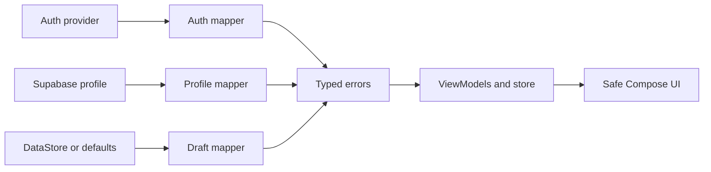

# Requirements

### Overview & Goals
Harden app error handling in small, independently validated slices so users never see provider, SDK, database, HTTP, serialization, or platform exception text. Preserve the already-correct authenticated-session/profile routing: a profile read or provisioning failure stays retryable and never sends a returning user into onboarding.

### Scope

#### In scope
- Replace raw Google/Apple sign-in and startup exception messages with safe, typed user messages.
- Make final onboarding submission failures visible and retryable without marking local onboarding complete too early.
- Make Android `DataStore`, iOS `NSUserDefaults`, and malformed local-draft failures observable with safe feedback while retaining usable in-memory state.
- Explain contact-import permission or picker failures on the onboarding contact screen.
- Localize all remaining user-facing error messages across the home, shared, and subscription modules in English and Spanish.
- Add focused common tests and platform compilation checks for each slice.

#### Out of scope
- Supabase schema, RLS, OAuth provider configuration, or auth-session persistence changes.
- A general application-wide error framework.
- Reworking onboarding navigation, successful sign-in routing, or the existing onboarding UI design.

### User Stories
- As a user, I want sign-in failures explained plainly so I know to retry without seeing technical provider details.
- As a user, I want setup submission failures to remain on the final step so I can retry without losing my progress.
- As a user, I want to know when my local progress could not be restored or saved instead of assuming it was persisted.
- As a user, I want contact-import denial or unavailability explained instead of seeing no response.

### Acceptance Criteria
1. No onboarding UI path renders `NativeSignInResult.message`, exception `message`, `OnboardingProfileError.Unknown.detail`, or platform/database terminology.
2. Sign-in cancellation remains quiet; provider, network, and unexpected failures show safe retry-oriented copy; successful sign-in behavior is unchanged.
3. A failed final submission shows the existing friendly error through the screen, leaves the draft retryable at the notification step, and navigates to the main app only after server success.
4. Draft read, write, clear, and malformed-data failures produce safe feedback, do not silently delete malformed persisted data, and preserve the latest in-memory draft where possible.
5. Contact permission denial or picker/read failure produces a friendly onboarding message and does not crash or appear to do nothing.
6. Each slice has focused automated coverage and the onboarding common/test compilation remains green.

# Technical Design

### Current Implementation
- `onboarding/src/commonMain/kotlin/app/usenekko/onboarding/welcome/WelcomeScreen.kt` assigns provider result text and `"Error: ${e.message}"` directly to the visible sign-in error.
- `onboarding/src/commonMain/kotlin/app/usenekko/onboarding/domain/OnboardingProfileErrorMessages.kt` still interpolates `Unknown.detail`; `OnboardingApp.kt` and `WelcomeScreen.kt` already use the typed `OnboardingProfileError.toUserMessage()` boundary for profile-routing feedback.
- `NotificationViewModel.completeOnboarding()` writes `currentStep = OnboardingStep.Complete` before `submitOnboarding()` succeeds, while `NotificationScreen.kt` currently ignores `NotificationEvent.ShowError`; the existing snackbar/event pattern in `ContactScreen.kt` is the UI precedent.
- `OnboardingDraftLocalDataSource`, `OnboardingDraftStore`, `DataStoreOnboardingDraftDataSource`, and `NSUserDefaultsOnboardingDraftDataSource` currently use plain return values and fire-and-forget persistence; the platform sources silently remove malformed drafts.
- `ContactScreen.kt` passes an empty `onPermissionDenied` callback to the shared picker, and the Android picker can throw while reading a selected contact.

### Key Decisions
- Use the selected data/integration-boundary approach: classify external failures into typed onboarding errors before they reach Compose; screens render only safe message functions, while diagnostic logs remain separate from UI state.
- Keep the existing `Result`/`EmptyResult`, `StateFlow`, `Channel`, and `toUserMessage()` conventions rather than introducing a broad application error framework.
- Deliver the work sequentially: authentication messages first, then final submission, local persistence, and contact import. Each stage must be green before the next stage begins.
- Keep malformed persisted data intact when decoding fails; report a typed corruption error and use a safe in-memory fallback so the app does not silently erase user data.
- Do not alter Supabase schema or the already-fixed session/profile routing contract.

### Data Models / Contracts
Add small common-domain error types following `OnboardingProfileError`:

```kotlin
sealed interface OnboardingAuthError {
    data object Network : OnboardingAuthError
    data object Provider : OnboardingAuthError
    data object Unexpected : OnboardingAuthError
}

sealed interface OnboardingDraftStorageError {
    data object Read : OnboardingDraftStorageError
    data object Write : OnboardingDraftStorageError
    data object Clear : OnboardingDraftStorageError
    data object Corrupt : OnboardingDraftStorageError
}
```

Change the local data-source seam to return the repository `Result` types:

```kotlin
suspend fun getDraft(): Result<OnboardingDraft, OnboardingDraftStorageError>
suspend fun saveDraft(draft: OnboardingDraft): EmptyResult<OnboardingDraftStorageError>
suspend fun clearDraft(): EmptyResult<OnboardingDraftStorageError>
```

`OnboardingDraftStore` will expose a safe storage-error state/event to the onboarding shell, retain its in-memory draft on write failures, and avoid clearing a corrupt raw payload automatically.

### Architecture Diagram


### Proposed Changes & File Structure

#### Authentication and profile messages
- Add `onboarding/src/commonMain/kotlin/app/usenekko/onboarding/domain/OnboardingAuthError.kt` and safe message mapping.
- Update `WelcomeScreen.kt` so `NativeSignInResult.Error`, network failures, and `startFlow()` exceptions never become visible raw strings; cancellation remains silent.
- Update `OnboardingProfileErrorMessages.kt` so `Unknown` always maps to generic retry copy without `detail`.
- Add common message/classification tests under `onboarding/src/commonTest/kotlin/app/usenekko/onboarding/`.

#### Final submission
- Update `NotificationViewModel.kt` to submit a snapshot that remains at `OnboardingStep.Notification`; clear local draft and emit navigation only after success.
- Keep the permission flags in the draft on failure and allow the final action to retry.
- Update `NotificationScreen.kt` to collect `ShowError` and render it through a `SnackbarHost`, following the existing `ContactScreen` pattern.
- Extend `NotificationViewModelTest.kt` with success/failure/retry-state coverage.

#### Local draft persistence
- Update `OnboardingDraftLocalDataSource.kt`, `OnboardingDraftStore.kt`, `DataStoreOnboardingDraftDataSource.kt`, and `NSUserDefaultsOnboardingDraftDataSource.kt` to classify read/write/clear/corruption failures.
- Wire the store’s safe error event/state into the onboarding shell in `OnboardingApp.kt` so failures are visible on every onboarding step without duplicating UI logic.
- Preserve the platform raw draft on decode failure and update all common-test fakes plus a dedicated store test.

#### Contact import
- Add a picker-failure action/event in `ContactAction.kt`, `ContactEvent.kt`, and `ContactViewModel.kt`.
- Replace the empty callback in `ContactScreen.kt` with a friendly snackbar message and resource-backed copy in both onboarding `strings.xml` files.
- Harden `shared/src/androidMain/kotlin/app/usenekko/shared/contacts/ContactPicker.android.kt` and the iOS counterpart so permission, presentation, and contact-read failures use the existing callback rather than escaping or disappearing.

### Risks
- Changing the draft data-source contract requires updating every common-test fake; compile both common code and the iOS test target after that slice.
- Platform picker behavior is difficult to exercise in common tests, so keep the expect/actual callback contract stable and verify both platform sources compile.
- A generic fallback must be used whenever classification is uncertain; no raw detail may cross into Compose state.

# Testing

### Validation Approach
Use the existing `onboarding/src/commonTest` unit-test seam with fake profile and draft data sources, then compile the common and iOS test targets after each implementation slice. The planned baseline is branch `feature/error-handling` at `50c679925c4893c3e70e534fd16e17338cc48023`; the working tree is clean.

### Key Scenarios
- Auth message tests verify provider/network/unexpected failures are safe, cancellation has no error message, and profile `Unknown(detail)` never includes the detail.
- Notification tests verify submission failure emits `ShowError`, leaves `currentStep` at `Notification`, keeps the draft available for retry, and navigates/clears only after success.
- Draft-store tests verify read/write/clear failures are classified, in-memory edits survive a failed write, and malformed data reports `Corrupt` without automatic deletion.
- Contact tests verify the picker failure callback emits a user-facing event; platform compilation verifies the Android/iOS actual implementations satisfy the shared contract.

### Edge Cases
- Provider callback returns a technical message containing OAuth, HTTP, SDK, or database terms.
- `startFlow()` throws before a provider callback, or the user cancels the flow.
- Submission fails after notification permission handling and is retried.
- JSON decoding, DataStore/`NSUserDefaults` access, or draft clearing throws.
- Contact permission is denied, the iOS presenter is unavailable, a selected Android contact cannot be queried, or the picker returns no contact.

### Test Changes
- Add common pure mapper/message tests for `OnboardingAuthError` and `OnboardingProfileError`.
- Extend `NotificationViewModelTest.kt` and add `OnboardingDraftStoreTest.kt` with deterministic fakes.
- Add contact-event coverage in the onboarding common tests.
- Run the focused validation after each slice:
  `./gradlew :onboarding:compileCommonMainKotlinMetadata :onboarding:compileTestKotlinIosSimulatorArm64 --rerun-tasks`
- Run the relevant platform compile tasks when available; preserve and report any pre-existing Android-main compilation blockers outside these slices.

# Delivery Steps

### ✓ Step 1: Sanitize onboarding authentication failures
All Google/Apple sign-in failures show safe retry copy and never expose provider or exception text.

- Add typed `OnboardingAuthError` and its safe message mapping in the common onboarding domain.
- Update `WelcomeScreen.kt` to map provider results and `startFlow()` exceptions before setting visible state; keep cancellation silent and retain diagnostics outside UI state.
- Change `OnboardingProfileErrorMessages.kt` so unknown profile failures use generic copy without `detail`.
- Add common regression tests for auth categories and profile-message sanitization.
- Validate with `./gradlew :onboarding:compileCommonMainKotlinMetadata :onboarding:compileTestKotlinIosSimulatorArm64 --rerun-tasks`.

### ✓ Step 2: Protect final onboarding submission
A failed final submission remains retryable on the notification step and displays a friendly error.

- Update `NotificationViewModel.kt` to keep the draft at `OnboardingStep.Notification` until `submitOnboarding()` returns success.
- Preserve notification permission fields on failure; clear the draft and navigate only on success.
- Update `NotificationScreen.kt` to display `NotificationEvent.ShowError` through a `SnackbarHost` and leave the finish action retryable.
- Extend `NotificationViewModelTest.kt` for failure, retry-state, and success navigation behavior.
- Re-run the focused common/iOS test compilation command before proceeding.

### ✓ Step 3: Make draft persistence observable
Local draft failures are classified, reported safely, and no longer silently erase malformed persisted data.

- Change `OnboardingDraftLocalDataSource` to return typed `Result`/`EmptyResult` values using `OnboardingDraftStorageError`.
- Update `OnboardingDraftStore.kt`, Android `DataStoreOnboardingDraftDataSource.kt`, and iOS `NSUserDefaultsOnboardingDraftDataSource.kt` to classify read/write/clear/corruption failures and retain raw corrupt data.
- Expose the store error state/event through `OnboardingApp.kt` as a safe onboarding-shell message while preserving in-memory edits.
- Update all common-test fakes and add `OnboardingDraftStoreTest.kt` for read, write, clear, and corruption cases.
- Validate common code and the iOS test target, then compile the affected Android/iOS platform sources.

### ✓ Step 4: Explain contact import failures
Permission denial and contact-picker/read failures produce a friendly onboarding message instead of silence or a crash.

- Add a contact-picker failure action/event through `ContactAction.kt`, `ContactEvent.kt`, and `ContactViewModel.kt`.
- Connect the existing `ContactScreen.kt` snackbar host to the picker callback and add matching English/Spanish resource copy.
- Harden `ContactPicker.android.kt` and `ContactPicker.ios.kt` at their existing callback boundary for denied permission, unavailable presentation, and contact-read failures.
- Add common event coverage and compile both platform actual implementations.
- Finish with `./gradlew :onboarding:compileCommonMainKotlinMetadata :onboarding:compileTestKotlinIosSimulatorArm64 --rerun-tasks` plus the affected platform compile tasks.

### ✓ Step 5: Localize app-wide error messages
All user-facing error messages in home, shared, and subscription flows use English or Spanish resources instead of hardcoded English text.

- Audit the home, shared, and subscription UI error paths and identify every user-visible error string.
- Add matching English and Spanish resources in the owning module and resolve them at the Compose UI boundary.
- Keep typed error classification and retry behavior unchanged; do not expose raw exception or provider details.
- Add focused regression coverage for the localized error mappings and compile the affected common/platform targets.